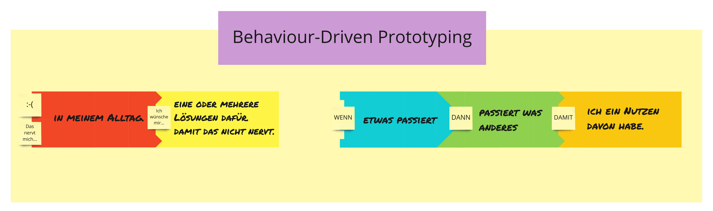

# Prototyping Fields

## Inventor Scroll

Flip-Chart-Papier (a 45cmx160cm)
Edding-Stifte (2x)

## Problem Field

The problem or needs field is where the co-creator sets out to define their problem in order to create the right thing.

### "Das nervt mich..."
DIN-A4 Blatt (rot)

As a pain point in order to express something bothersome in the day to day.

### "Ich wünsche mir..."
DIN-A4 Blatt (gelb)

A wish about a certain solution in order to solve the problem or fulfil a specific need.

## Solution Field

Co-Create the thing right. Once the problem has been defined, it is time to go about finding the right solution by prototyping different possible solutions with a simple causality chain "When something happens, then something else happens." (cause and effect)

### WENN
DIN-A4 Blatt (light blue)

The first part of the causality chain: "When something happens..." (the cause)

### DANN
DIN-A4 Blatt (green)

The second part of the causality chain: "..., then something else happens." (the effect)

### DAMIT
DIN-A4 Blatt (orange)

This explains the benefit that certain solution has for the intended person.

